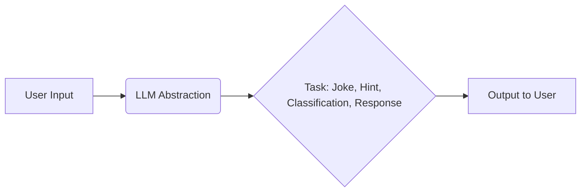
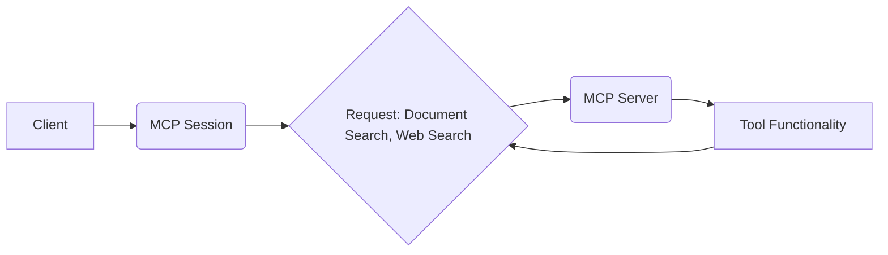
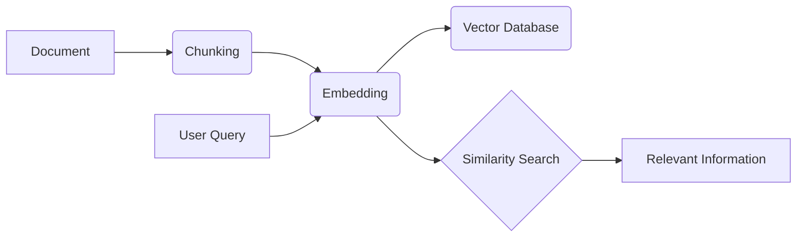
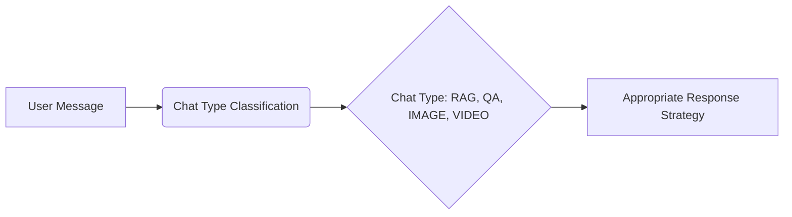
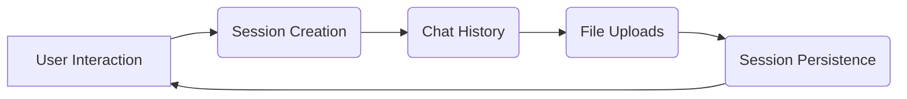
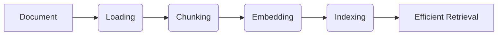
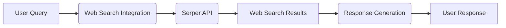

# Overview

# Project Overview: Intelligent Chat System

This document provides a high-level overview of the intelligent chat system.  It outlines the key components, their functionalities, and how they interact with each other. This system leverages Large Language Models (LLMs), Retrieval-Augmented Generation (RAG), and a modular communication protocol (MCP) to provide a versatile and context-aware conversational experience.

## Core Abstractions (Key Components)

These are the primary functional units of the system.

*   **LLM Abstraction:**
    *   **Description:**  This component acts as the brain of the system, utilizing a Large Language Model (LLM) to perform various tasks. This includes generating supportive content (jokes), providing game hints, classifying chat types, and generating contextually relevant responses based on different input types (text, images, video).
    *   **Functionality:**
        *   Generates text, answers questions, and provides hints.
        *   Classifies user input to determine the appropriate response strategy.
        *   Adapts responses based on information retrieved from RAG and web searches.
    *   **Related Files:** `mental_health_buddy_jac`, `guess_game6_jac`, `server_jac`, `server_impl_jac`, `utils_jac`

*   **MCP (Modular Component Protocol):**
    *   **Description:** This protocol enables communication between different tools and services within the system. It allows the system to extend its capabilities by integrating new tools.  It uses a client-server architecture.
    *   **Functionality:**
        *   Provides a standardized way for components to request services from each other.
        *   Enables integration of external tools and services.
    *   **Related Files:** `mcp_client_jac`, `mcp_server_jac`, `server_jac`, `server_impl_jac`

*   **RAG (Retrieval-Augmented Generation) Engine:**
    *   **Description:** This engine facilitates document processing and search.  It retrieves relevant information from a knowledge base to enhance the LLM's responses.
    *   **Functionality:**
        *   Loads and processes documents.
        *   Splits documents into chunks.
        *   Creates embeddings (numerical representations) of text.
        *   Performs similarity searches to find relevant information based on user queries.
    *   **Related Files:** `tools_jac`, `server_jac`, `server_impl_jac`

*   **Chat Type Classification:**
    *   **Description:**  This component categorizes user messages based on their content (e.g., RAG-related, question answering, image-related, video-related).
    *   **Functionality:**
        *   Analyzes user messages to determine the appropriate response strategy.
        *   Directs requests to the correct tool or service.
    *   **Related Files:** `server_jac`, `server_impl_jac`

*   **Session Management:**
    *   **Description:**  This manages user sessions, maintaining context across multiple interactions.
    *   **Functionality:**
        *   Creates and manages user sessions.
        *   Persists chat history.
        *   Handles file uploads.
    *   **Related Files:** `server_jac`, `server_impl_jac`, `client_jac`

*   **Document Processing Pipeline:**
    *   **Description:** This defines the steps involved in preparing documents for use by the RAG engine.
    *   **Functionality:**
        *   Loads documents.
        *   Chunks documents into smaller pieces.
        *   Embeds document chunks.
        *   Indexes the embedded chunks for efficient retrieval.
    *   **Related Files:** `tools_jac`, `server_impl_jac`

*   **Web Search Integration:**
    *   **Description:** This allows the system to perform web searches and incorporate the results into its responses.
    *   **Functionality:**
        *   Performs web searches using an external API (e.g., Serper).
        *   Integrates web search results into the response generation process.
    *   **Related Files:** `tools_jac`, `mcp_server_jac`

## Relationships Between Abstractions

This section describes how the different components interact.

*   **LLM Abstraction uses RAG for information retrieval:**  The LLM uses the RAG engine to retrieve relevant information from documents and provide more informed responses.
*   **LLM Abstraction relies on chat type for response strategy:** The LLM uses the chat type classification to determine the appropriate way to respond to a user's message.
*   **MCP can be used to access LLM functionalities:** The MCP allows other components or external systems to access the LLM's capabilities.
*   **MCP can be used to access web search functionalities:** The MCP allows other components to trigger web searches.
*   **RAG utilizes the document processing pipeline:** The RAG engine relies on the document processing pipeline to prepare documents for searching.
*   **Chat type influences session handling:** The type of chat (e.g., RAG, QA) can affect how the session is managed.
*   **Session history informs LLM responses:** The LLM uses the chat history stored in the session to maintain context and provide more relevant responses.
*   **Web search results augment LLM responses:**  The LLM incorporates information from web searches into its responses.
*   **RAG can be enhanced with web search:**  The RAG engine can use web search to supplement its document-based knowledge.

## Overall System Flow (Simplified)

1.  A user sends a message to the system.
2.  **Chat Type Classification** analyzes the message and determines the chat type.
3.  **Session Management** retrieves the user's chat history.
4.  The **LLM Abstraction** processes the message, potentially using:
    *   **RAG:** If the chat type is RAG-related, the RAG engine retrieves relevant information from the document store.
    *   **Web Search Integration:** If appropriate, the system performs a web search using **MCP** and incorporates the results.
5.  The **LLM Abstraction** generates a response, taking into account the chat history, RAG results, and web search results.
6.  The system sends the response back to the user.
7.  **Session Management** updates the chat history with the new message and response.

## Conclusion

This intelligent chat system utilizes a modular architecture and powerful technologies like LLMs and RAG to provide a rich and context-aware conversational experience. The use of MCP allows for easy extension and integration of new tools and services.

## Chapters

### Chapter 1: LLM Abstraction

# LLM Abstraction

## High-Level Explanation

This chapter explores the use of Large Language Models (LLMs) within the project. LLMs are utilized for a variety of tasks, including generating supportive jokes, providing hints in a game, classifying chat types, and generating context-aware responses. This abstraction highlights the LLM's role in enhancing user interaction and providing intelligent functionality.

## Key Concepts

*   Gemini API
*   Model Abstraction
*   Contextual Response Generation
*   Chat Type Classification

## Mermaid Diagram

## Conclusion

The LLM abstraction demonstrates the versatility of LLMs in providing intelligent and context-aware functionality across different application areas within the project. By abstracting the LLM, the project can easily switch between different models and adapt to new use cases.

### Chapter 2: MCP (Modular Component Protocol)

# MCP (Modular Component Protocol)

## High-Level Explanation

This chapter details the Modular Component Protocol (MCP), a communication protocol that enables interaction between different tools and services within the project. MCP allows for functionalities such as document search and web search to be integrated seamlessly. The protocol involves a client for making requests and a server for providing tool functionalities.

## Key Concepts

*   Client-Server Communication
*   Tool Integration
*   Request Handling
*   Asynchronous Communication

## Mermaid Diagram

## Conclusion

The MCP abstraction facilitates modularity and extensibility within the project. By defining a standardized protocol for communication, the project can easily integrate new tools and services without modifying existing components.

### Chapter 3: RAG (Retrieval-Augmented Generation) Engine

# RAG (Retrieval-Augmented Generation) Engine

## High-Level Explanation

This chapter discusses the Retrieval-Augmented Generation (RAG) Engine, a system for document processing and search. The RAG engine involves loading documents, splitting them into chunks, creating embeddings, and performing similarity searches to retrieve relevant information based on a query. This abstraction is crucial for providing context-aware responses and information retrieval.

## Key Concepts

*   Document Loading
*   Chunking
*   Embedding Generation
*   Similarity Search
*   Context Retrieval

## Mermaid Diagram

## Conclusion

The RAG engine abstraction enables the project to effectively process and search documents, providing users with relevant information based on their queries. This abstraction is essential for applications that require access to a large corpus of documents.

### Chapter 4: Chat Type Classification

# Chat Type Classification

## High-Level Explanation

This chapter explains the process of Chat Type Classification, which involves categorizing user messages into different types of chats (RAG, QA, IMAGE, VIDEO) to determine the appropriate response strategy. This abstraction ensures that user messages are handled correctly and efficiently.

## Key Concepts

*   Message Categorization
*   Response Strategy
*   Chat Types (RAG, QA, IMAGE, VIDEO)
*   Classification Logic

## Mermaid Diagram

## Conclusion

The Chat Type Classification abstraction allows the project to adapt to different types of user interactions, providing a more tailored and efficient response. By classifying chat types, the project can optimize its response strategy for each type of interaction.

### Chapter 5: Session Management

# Session Management

## High-Level Explanation

This chapter covers the handling of user sessions, including creation, persistence of chat history, and file uploads, to maintain context across multiple interactions. Session management is critical for providing a seamless and personalized user experience.

## Key Concepts

*   Session Creation
*   Chat History Persistence
*   File Uploads
*   Context Maintenance
*   User Identification

## Mermaid Diagram

## Conclusion

The Session Management abstraction ensures that user interactions are tracked and maintained across multiple sessions, providing a more personalized and seamless user experience. By persisting chat history and file uploads, the project can maintain context and provide more relevant responses.

### Chapter 6: Document Processing Pipeline

# Document Processing Pipeline

## High-Level Explanation

This chapter details the series of steps involved in processing documents, including loading, chunking, embedding, and indexing, to enable efficient retrieval and use of document content. The document processing pipeline is a core component of the RAG engine and is essential for providing context-aware responses.

## Key Concepts

*   Document Loading
*   Chunking
*   Embedding Generation
*   Indexing
*   Efficient Retrieval

## Mermaid Diagram

## Conclusion

The Document Processing Pipeline abstraction enables the project to efficiently process and index documents, providing a foundation for context-aware responses and information retrieval. By optimizing the pipeline, the project can improve its ability to handle large volumes of documents and provide more relevant results.

### Chapter 7: Web Search Integration

# Web Search Integration

## High-Level Explanation

This chapter describes the capability to perform web searches using an external API (Serper) and incorporate the results into the response generation process. Web search integration allows the project to access up-to-date information and provide more comprehensive responses.

## Key Concepts

*   External API Integration
*   Web Search
*   Response Generation
*   Information Retrieval
*   Serper API

## Mermaid Diagram

## Conclusion

The Web Search Integration abstraction enhances the project's ability to provide comprehensive and up-to-date responses by leveraging external web search APIs. This abstraction allows the project to access a vast amount of information and provide more relevant and accurate results.

