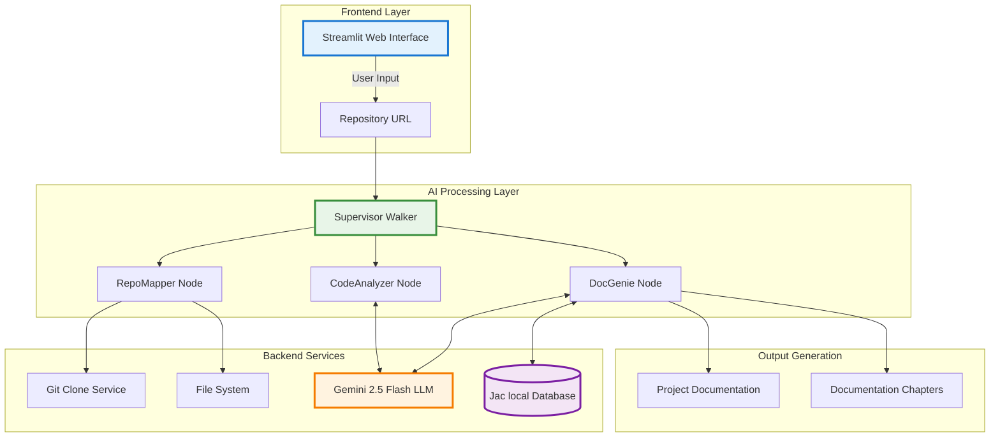
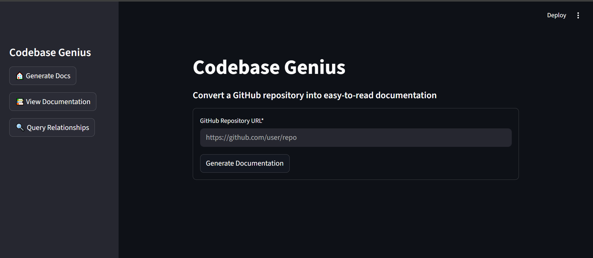

# Codebase Genius 

An AI-powered, multi-agent system that automatically generates high-quality documentation for any software repository. Built with Jac (JacLang) and powered by LLMs, Codebase Genius transforms complex codebases into clear, comprehensive, beginner-friendly documentation with interactive diagrams and intelligent code analysis.

[](https://opensource.org/licenses/MIT)
[](https://www.python.org/downloads/)
[](https://github.com/Jaseci-Labs/jaclang)

---

## Demo Video

> **Watch the system in action:**
> 
> [](https://www.youtube.com/watch?v=YOUR_VIDEO_ID)
>
> 🔗 **[Click here to watch the full demonstration](https://www.youtube.com/watch?v=YOUR_VIDEO_ID)**

---

## Features

### Core Capabilities

- **Multi-Agent Architecture**: Coordinated AI agents (Supervisor, RepoMapper, CodeAnalyzer, DocGenie) work together to analyze and document code
- **Code Context Graph (CCG)**: Automatically builds function call graphs showing relationships between components
- **Natural Language Queries**: Ask questions like "Which functions call train_model?" to explore your codebase
- **Smart Caching**: Lightning-fast subsequent requests using intelligent caching
- **Markdown Generation**: Beautiful, structured documentation with diagrams and clear explanations
- **RESTful API**: Full HTTP API for programmatic access
- **Multi-Language Support**: Optimized for Python and Jac, extensible to other languages

### Advanced Features

- **Iterative README Summarization**: Handles large READMEs by processing them in chunks
- **Intelligent File Filtering**: LLM-powered selection of meaningful source files
- **Abstraction Extraction**: Identifies key concepts and architectural patterns
- **Relationship Mapping**: Discovers connections between code components
- **Chapter Ordering**: Organizes documentation for optimal learning flow
- **Post-Processing Pipeline**: Automatic cleanup and CCG generation
- **Interactive Frontend**: Streamlit-based UI for easy interaction

---

## System Architecture

Codebase Genius implements a sophisticated multi-agent pipeline where specialized agents collaborate to analyze and document code:

### Agent Roles

#### 1. **Supervisor (Code Genius)** 
- Orchestrates the entire workflow
- Receives GitHub URLs and validates repositories
- Delegates tasks to subordinate agents
- Aggregates results and manages caching
- Decides operation order based on repository structure

#### 2. **Repo Mapper** 
- Clones the repository to local storage
- Generates file-tree representations
- Summarizes README.md iteratively for large documents
- Filters meaningful source files using LLM reasoning
- Provides high-level overview to guide analysis

#### 3. **Code Analyzer** 
- Parses source files (Python AST-based, extensible to Tree-sitter)
- Constructs Code Context Graph (CCG) showing:
  - Function and method definitions
  - Class hierarchies
  - Call relationships (who calls what)
  - Module dependencies
- Extracts key abstractions and architectural patterns
- Identifies relationships between components

#### 4. **Doc Genie** 
- Synthesizes structured data into markdown documentation
- Generates project overview and chapter structure
- Creates beginner-friendly explanations
- Integrates mermaid diagrams for visualization
- Produces well-organized, human-readable output

### Architecture Diagram



---


## Technologies & Tools Used

* **Jac Language** – Agent-oriented programming with native LLM integration (`jaclang`, `jac-cloud`)
* **byllm** – Multi-tool LLM framework for reasoning and function calling 
* **Google Gemini** – LLM API Key
* **Streamlit** – Interactive web interface with real-time updates and progress tracking
* **GitPython** – Seamless Git repository operations and cloning
* **Jaseci Runtime** – Local database and walker execution engine for caching
* **Git** – Version control and repository management

> 
> 
> 
> 
> 
> 

---

## Getting Started

### Installation

1. **Clone the repository**:
   ```bash
   git clone https://github.com/Mr-waweru/Jaseci-repo.git
   cd Codebase_genius
   ```

2. **Create and activate virtual environment**
   ```bash
   python3 -m venv venv      # On Linux: source venv\Scripts\activate   
   source venv/bin/activate  # On Windows: venv\Scripts\activate
   ```

3. **Install dependencies**:
   ```bash
   pip install -r requirements.txt
   ```

4. **Set up environment variables**
   Create a `.env` file:
   ```env
   GEMINI_API_KEY=your_gemini_api_key_here
   ```
      
   > Get your Gemini API key from [Google AI Studio](https://makersuite.google.com/app/apikey)


### Running the Application

#### Option 1: Manual Startup

**Terminal 1 - Backend:**
```bash
cd BE
jac serve main.jac
```

**Terminal 2 - Frontend:**
```bash
cd FE
streamlit run app.py
```

### Accessing the Application

- **Frontend UI**: http://localhost:8501
- **Backend API**: http://localhost:8000
- **API Docs**: http://localhost:8000/docs

---

## Usage Guide

### 1. Generate Documentation

<!-- Add screenshot of input page -->
1. Navigate to http://localhost:8501


2. Enter a GitHub repository URL (e.g., `https://github.com/user/repo`)
3. Click "Generate Documentation"
4. Wait for processing (typically 2-5 minutes depending on repo size)

### 2. View Documentation
Click `View Documentation`. Once generated, you can:
- Browse the overview section
- Navigate through chapters using the sidebar
- Download the complete documentation as markdown

### 3. Query Code Relationships
Click `Query Relationships`. Ask natural language questions about your codebase:
- "Which functions call train_model?"
- "What does process_data call?"
- "Show me callers of the login function"

The system will:
- Parse your question
- Extract the function name
- Query the Code Context Graph
- Display results with depth and relationship information

### 4. Example Queries
- See Outputs [BE/outputs](BE/outputs/)

---

## Project Structure


```
codebase_genius/
├── BE/                          # Backend (Jac + Python)
│   ├── main.jac                 # Main Jac graph interface (nodes, edges)
│   ├── main.impl.jac            # Walker implementations & orchestration
│   ├── utils.jac                # LLM utility functions & tool definitions
│   ├── ccg_builder.py           # Code Context Graph builder (AST parser)
│   ├── post_process.py          # Post-processing: CCG generation & cleanup
│   ├── unified_api.py           # Combined API (Jac + CCG endpoints)
│   └── .env                     # Environment variables (API keys)
│
├── FE/                          # Frontend (Streamlit)
│   └── app.py                   # Streamlit web interface
│
├── outputs/                     # Generated documentation storage
│   └── <repo_name>/
│       ├── docs.md              # Generated documentation
│       ├── ccg.json             # Code Context Graph
│       └── cached_docs.json     # Cache metadata
│
├── start.sh                     # Start all services
├── stop.sh                      # Stop all services
├── .env                         # Environment variables (API keys)
├── requirements.txt             # Python dependencies
├── INTEGRATION_GUIDE.md         # Technical integration guide
└── README.md                    # This file
```

---

## Troubleshooting

### Common Issues

#### 1. Gemini API Errors

If you see "model is overloaded" errors:

1. Wait 30-60 seconds and retry
2. Or switch to a different model in `BE/utils.jac`:
   ```python
   glob llm = Model(model_name="gemini/gemini-2.0-flash", verbose=False); # or(.../gemini-2.5-flash...)
   ```

#### 2. CCG Not Generated

The CCG is built during post-processing. If missing:

1. Check `logs/backend.log` for post-processing errors
2. Verify `outputs/<repo_name>/ccg.json` exists
3. Try regenerating documentation
4. Ensure repository has parseable source files

#### 3. Empty or Incomplete Documentation

Possible causes:
- Repository has no README.md
- No parseable source files found
- LLM API rate limits
- Check logs for specific errors

---

## Design Decisions

### Why Multi-Agent Architecture?

- **Separation of Concerns**: Each agent has a focused responsibility
- **Parallelization Potential**: Agents can work concurrently (future enhancement)
- **Maintainability**: Easier to debug and extend individual agents
- **Scalability**: New agents can be added without modifying existing ones

### Why Jac (JacLang)?

- **Graph-Native**: Perfect for representing code relationships
- **Walker Pattern**: Natural fit for traversal-based analysis
- **LLM Integration**: Built-in support for AI-powered reasoning
- **Declarative**: Expressive syntax for agent behaviors

### Why Caching?

- **Performance**: Instant responses for repeated requests
- **Cost Reduction**: Fewer LLM API calls
- **User Experience**: No waiting for already-processed repos

---

## Contributing

We welcome contributions! Here's how to get started:

1. Fork the repository
2. Create a feature branch (`git checkout -b feature/amazing-feature`)
3. Make your changes
4. Add tests if applicable
5. Commit with clear messages (`git commit -m 'Add amazing feature'`)
6. Push to your branch (`git push origin feature/amazing-feature`)
7. Open a Pull Request

### Contribution Guidelines

- Follow existing code style and conventions
- Document new features thoroughly
- Test your changes on multiple repositories
- Update README if adding user-facing features

---

## Acknowledgments
- **Prof. Jason Mars** for your guidance and amazing lectures
- **Jaseci Team** for your invested enthusiasm and encouragement in my success
- **OUK Team** for your partnership with BCS, Jaseci Team & providing this Generative AI Seminar Free
- **Jaseci Labs** for the JacLang framework and byLLM library
- **Google** for Gemini API
- **Streamlit** team for the excellent UI framework
