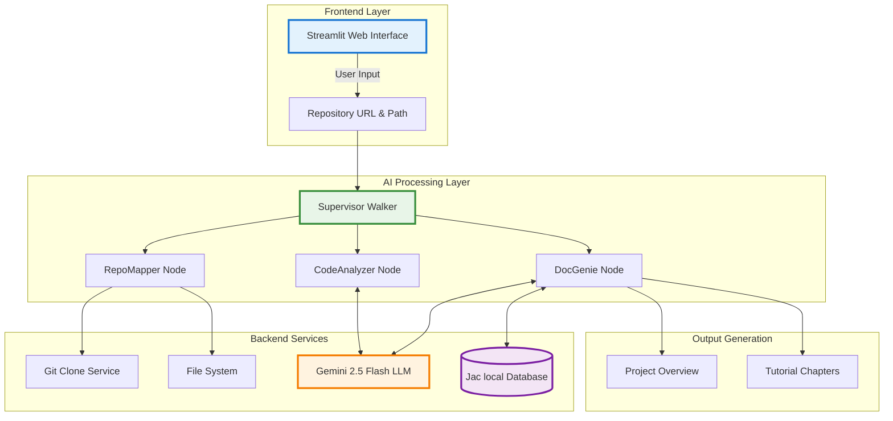

# Codebase Genius

Codebase Genius is an autonomous, multi-agent system that converts a public GitHub repository into high-quality, human-readable Markdown documentation — complete with prose explanations and architecture diagrams. The implementation is optimized for Python and Jac codebases but is designed to be generalisable to other languages.

---

## High-Level Architecture

Our system follows a clean, modular architecture with three main components working in harmony:



---

## Core Functionalities

### **Intelligent Repository Analysis**
- **Smart File Filtering**: Automatically identifies and focuses on essential source code files
- **Abstraction Extraction**: Uses AI to identify key programming concepts and patterns
- **Relationship Mapping**: Discovers how different components interact with each other
- **Architecture Understanding**: Comprehends the overall system design and data flow

### **AI-Powered Tutorial Generation**
- **Chapter Organization**: Structures content in logical learning progression
- **Beginner-Friendly Explanations**: Converts complex code into understandable concepts
- **Visual Diagrams**: Generates Mermaid diagrams for architectural understanding

### **Universal Language Support**
- **Multi-Language Compatibility**: Works with Python, JavaScript, Java, C++, Flutter, Dart, Go, Rust, and more
- **Framework Recognition**: Understands popular frameworks like React, Django, Spring, Flutter, etc.
- **Specialized Languages**: Supports unique languages like Jac (Jaseci Action Language)
- **Mixed Codebases**: Handles projects with multiple programming languages

### **Local Database Integration**
- **Jac Database**: Serves tutorials through local database for fast access
- **Caching System**: Stores processed tutorials to avoid regeneration
- **Persistent Storage**: Maintains generated content across sessions

### **Tutorial Export & Download**
- **Markdown Export**: Download complete tutorials as `.md` files to your local computer
- **Streamlit Integration**: Seamless download functionality through the web interface
- **Portable Format**: Generated documentation can be viewed, edited, and shared offline
- **One-Click Download**: Simple "Download Tutorial" button for instant file access

---

## Input & Output

### **What You Provide**
```
 GitHub Repository URL
           Example: https://github.com/user/awesome-project.git
```

<div align="center">
  
  <p><em>Input interface for providing GitHub repository URL and local directory path</em></p>
</div>

### **What You Get**
<div align="center">
  
  <p><em>Clean and intuitive web interface for generating AI-powered tutorials</em></p>
</div>

> Also you can download the complete tutorial as the Markdown file by clicking "Download Documentation"

---

## Technologies & Tools Used

* **Jac Language** – Agent-oriented programming with native LLM integration (`jaclang`, `jac-cloud`)
* **byllm** – Multi-tool LLM framework for reasoning and function calling 
* **Google Gemini** – Advanced AI for code understanding and generation (`google-generativeai`)
* **Streamlit** – Interactive web interface with real-time updates and progress tracking
* **GitPython** – Seamless Git repository operations and cloning
* **Jaseci Runtime** – Local database and walker execution engine for caching
* **Git** – Version control and repository management

> 
> 
> 
> 
> 
> 

---

## Getting Started

### Installation

1. **Clone the repository**:
   ```bash
   git clone https://github.com/Mr-waweru/Jaseci-repo.git
   cd Codebase_genius
   ```

2. **Install dependencies**:
   ```bash
   pip install -r requirements.txt
   ```

3. **Set up your Google API key**:
   ```bash
   # Windows (PowerShell)
   $env:GOOGLE_API_KEY="your_api_key_here"
   ```

4. **Start the application**:
   ```bash
   # 1: Run the Jac backend directly
   jac serve BE/main.jac
   
   # 2: Run the Streamlit web interface
   streamlit run FE/app.py
   ```

5. **Access the application**:
   - Open your browser to `http://localhost:8501`
   - Enter a GitHub repository URL
   - Click "Generate Documentation" 

---

## Project Structure

```
codebase_genius/
├── README.md             
├── .env
├── .gitignore
├── requirements.txt
├── BE/
│   ├── README.md
│   ├── utils.jac
│   ├── main.jac
│   └── main.impl.jac
└── FE/
    ├── README.md
    └── app.py

```

### **Core Files Explained**

| File | Purpose | Technology |
|------|---------|------------|
| `main.jac` | Defines the node architecture and main walker logic | Jac Language |
| `main.impl.jac` | Contains all implementations for repository analysis | Jac + Python |
| `utils.jac` | LLM utilities and helper functions with ReAct method | Jac + mtllm |
| `app.py` | Web interface for user interaction | Streamlit + Python |

---
